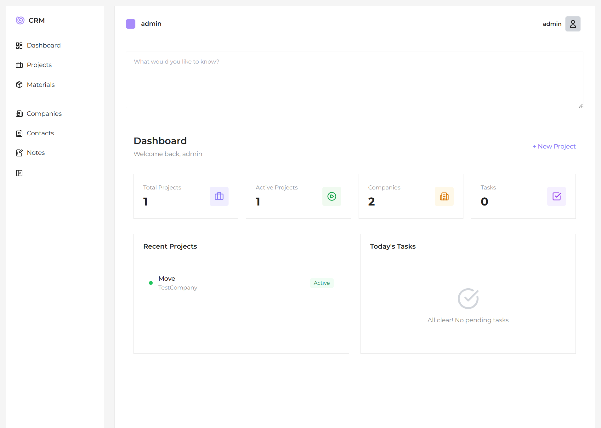

# CRM

A modern CRM built with Django 6.0.5 + Tailwind CSS + Alpine.js + HTMX.

## Tech Stack

- **Backend**: Django 6.0.5, Python 3.14+
- **Frontend**: Tailwind CSS 4, Alpine.js, HTMX, Lucide Icons
- **Database**: SQLite (dev) / PostgreSQL (prod)
- **Font**: Montserrat

## Features

- **Dashboard** — Stats overview, recent projects, today's tasks
- **Projects** — Full CRUD with status tracking, materials, contacts
- **Companies** — Company management with logo upload
- **Contacts** — Contact management linked to companies
- **Tasks** — Task management with priorities, statuses, assignments
- **Notes** — Universal notes linked to projects, companies, contacts
- **Dark Mode** — Toggle light/dark theme
- **Slide-over Forms** — All create/edit via animated left panel
- **Live Search** — HTMX-powered search and filters
- **Responsive** — Mobile-friendly layout
- **Activity Tracking** — created_at/updated_at on all records

## Quick Start

```bash
# Clone the repo
git clone <repo-url>
cd crm

# Install Python dependencies
python -m pip install -r requirements.txt

# Install Node dependencies
npm install

# Build Tailwind CSS
npm run build

# Run migrations
python manage.py migrate

# Create superuser
python manage.py createsuperuser

# Start dev server
python manage.py runserver
```

## Project Structure

```
config/              # Django project settings
  settings.py
  urls.py
accounts/            # Auth (login, logout, profile)
contacts/            # Companies & Contacts
projects/            # Projects & Materials
tasks/               # Tasks
notes/               # Notes
core/                # Dashboard, base models
templates/           # HTML templates
  base.html
  includes/
    sidebar.html     # Left navigation sidebar
    topbar.html      # Top bar with search & profile
    slide_over.html  # Slide-over panel for forms
    pagination.html  # Pagination component
static/
  src/styles.css     # Tailwind input
  dist/styles.css    # Tailwind output
media/               # Uploaded files
```

## Models

- **Company** — name, email, phone, website, address, logo
- **Contact** — company, first_name, last_name, email, phone, position, avatar
- **Project** — name, description, status, company, contacts, dates, budget, image
- **Material** — project, name, quantity, unit, unit_price
- **Task** — title, description, status, priority, due_date, project, assigned_to
- **Note** — title, content, project, company, contact

All models inherit from `TimeStampedModel` (created_at, updated_at, created_by, is_active).

## UX Pattern

All record creation and editing happens through a semi-transparent slide-over panel that slides in from the left side of the screen. This keeps the main content area stable and provides a focused form experience.

## P.S.

The first version. CRM will be updated and I have a lot of ideas about it. I'm working on changings.
You can to take CRM and change it for yourself if you want.
