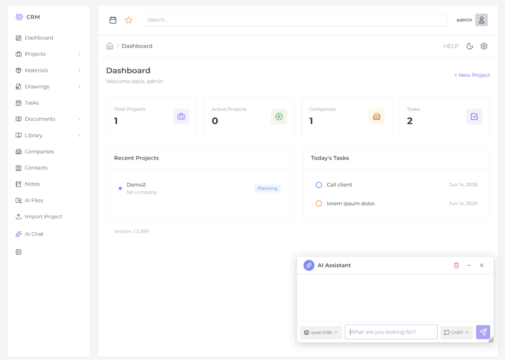

# CRM

**Django 6.0.6 + Tailwind CSS 4 + Alpine.js + HTMX + AI (Ollama / Cloud LLMs)**

A project management, contractor and task tracking system for engineering and manufacturing businesses.

---

## Fast install

To quickly install, run `install.bat` in an empty folder, then go to the `CRM` folder and run `runserver.bat`.

---

## Quick Start

```bash
python -m venv venv
venv/Scripts/activate
pip install -r requirements.txt
npm install
npm run build
python manage.py migrate
python manage.py createsuperuser
python manage.py runserver
```

Alternatively, run `install.bat` for one-click setup. Use `update.bat` to pull latest changes.
Username: admin
Password: admin

---

## Tech Stack

| Layer      | Technology |
|------------|-----------|
| Backend    | Django 6.0.6, Python 3.14+, SQLite |
| Frontend   | Tailwind CSS 4 (CDN + CLI build), Alpine.js 3.x, HTMX 2.0.4, Lucide Icons |
| AI         | Ollama (local), Anthropic, OpenAI, Google, Mistral, Groq, DeepSeek, OpenRouter, OpenCode |
| Build      | Tailwind CLI 4 (`npm run dev` / `npm run build`) |
| Protocol   | RESTful URLs, HTMX partials, slide-over panels |

---

## Modules

| Module | Description |
|--------|-------------|
| **Dashboard** | Key metrics, recent projects, tasks, notes |
| **Companies** | Company directory with contacts and details |
| **Contacts** | Contacts linked to companies |
| **Projects** | Full lifecycle: statuses, budget, dates, image gallery, ZIP export/import |
| **Materials / BOM** | Bill of Materials per project with categories and pricing |
| **Tasks** | Prioritized tasks with statuses, due dates, filtering |
| **Library** | Knowledge base with rich text (Quill.js), files, categories (nested), tags, favorites |
| **Notes** | Universal notes linkable to projects, companies, contacts |
| **Documents** | File upload with preview (images, PDF, text) |
| **Parts** | Engineering drawings and 3D models (.stp, .ipt, .sldprt, .ics, .sldasm, .iam) |
| **Calendar** | Three-month rolling calendar view with navigation |
| **Generator** | Module scaffolding template for rapid prototyping of new apps |

---

## AI Assistant

Powered by **Ollama** (local) + **multi-provider cloud AI** with two modes:

- **CHAT** — free conversation with any configured AI model
- **COMMANDS** — natural-language CRM actions via regex-based intent detection

### Supported AI Providers

Ollama (local), Anthropic, OpenAI, Google, Mistral, Groq, DeepSeek, OpenRouter, OpenCode — all configurable via the Settings panel.

### Setup (Ollama)

1. Install [Ollama](https://ollama.com)
2. Pull a model: `ollama pull llama3.2`
3. Start Ollama (runs on port 11434 by default)
4. Select the model in the CRM chat interface

### Example Commands

```
Create project 001, Office Building on 2026-06-15
Add task Call client on 2026-06-10
Find contact Ivan
Add material Bolt 50 to project Test
Upload file drawing.pdf to project Test
Show all drawings of project Test
Create note Meeting for project Test
Open bbc.com
Download file from https://example.com/image.png
Create file hello.py with content print("Hello, World!")
Search for latest Python 3.14 features
Find pdf on site https://example.com
```

### Capabilities

Browser agent (with SSRF protection), web search (DuckDuckGo), AI file management (extension allow/deny, 50 MB per file, 1 GB quota), 10-second undo, audit logging (AILog), model selection, two-step confirmation for write operations, file CRUD.

---

## Project Structure

```
CRM/
  config/            Settings, root URL config, WSGI/ASGI
  accounts/          Authentication (login, logout, profile, password reset)
  core/              Dashboard, base models (TimeStampedModel), activity log, global search, app settings, AI provider API
  companies/         Company directory
  contacts/          Contact directory (linked to companies)
  projects/          Project lifecycle, export/import (ZIP), file storage
  materials/         Bill of Materials per project
  tasks/             Task management
  notes/             Universal notes (linkable to any entity)
  documents/         File upload with preview (images, PDF, text)
  library/           Knowledge base (rich text, nested categories, tags, files, favorites)
  parts/             Engineering drawings and 3D models
  assistant/         AI chat, LLM integration, browser agent, file management, command handlers
  calendar_app/      Three-month rolling calendar view
  generator/         Module scaffolding template (Deal model as example)
  templates/         Base layout, includes (sidebar, topbar, chat, slide-over, pagination)
  static/            Tailwind CSS source (src/) and dist/
  media/             User-uploaded files
  ai_files/          AI-downloaded files
  documents/         Project-specific document storage
```

---

## URL Routing

| Prefix | Namespace | App |
|--------|-----------|-----|
| `/` | core | Dashboard, search, help, settings, AI provider API |
| `/accounts/` | accounts | Authentication |
| `/admin/` | admin | Django Admin |
| `/companies/` | companies | Company management |
| `/contacts/` | contacts | Contact management |
| `/projects/` | projects | Project management |
| `/tasks/` | tasks | Task management |
| `/notes/` | notes | Universal notes |
| `/materials/` | materials | Bill of Materials |
| `/deals/` | generators | Generator (Deals) |
| `/documents/` | documents | File upload |
| `/library/` | library | Knowledge base |
| `/parts/` | parts | Drawings / 3D models |
| `/assistant/` | assistant | AI chat |
| `/calendar/` | calendar_app | Calendar view |
| `/media/` | — | User-uploaded media (DEBUG) |
| `/files/` | — | Project documents (DEBUG) |
| `/ai-files/` | — | AI-downloaded files (DEBUG) |

---

## Data Models

All business models extend `TimeStampedModel` (abstract base):

| Field | Description |
|-------|-------------|
| `created_at` | Auto-set on creation |
| `updated_at` | Auto-updated on save |
| `created_by` | ForeignKey to User (nullable) |
| `is_active` | Boolean for soft-delete |

| Model | Key Fields | Relationships |
|-------|------------|---------------|
| **Company** | name, slug, email, phone, website, address, logo, notes | Referenced by Contact, Project, Note, Deal |
| **Contact** | first_name, last_name, slug, email, phone, position, avatar, notes | FK→Company |
| **Project** | name, slug, number, description, status, dates, budget, image | FK→Company; M2M→Contact |
| **ProjectImage** | image, uploaded_at | FK→Project |
| **Material** | name, slug, quantity, unit, unit_price, notes | FK→Project, Category |
| **Task** | title, slug, description, status, priority, due_date | FK→Project |
| **Note** | title, slug, content, date | FK→Project / Company / Contact |
| **Document** | number, size, file, file_type | FK→Project, Category |
| **LibraryItem** | title, slug, content, description, file, file_type, is_favorite | FK→Category (nested); M2M→Tag |
| **LibraryAttachment** | item (FK), file, name | FK→LibraryItem |
| **Part** | number, size, rev, file | FK→Project, Category |
| **Deal** | name, slug, description, status, priority, value, due_date | FK→Company; M2M→Contact; FK→User |
| **Category** | name, slug, color, icon, parent (self-referential) | Used in Materials, Documents, Parts, Library |
| **ChatSession** | user, title, is_active, last_message_at | Per-user AI sessions |
| **ChatMessage** | session, role, kind, content, payload | Chat messages (text/confirmation/result/undo) |
| **AIFile** | owner, file, original_name, source_url, size, category | AI-downloaded files |
| **AILog** | user, session, action, status, description, request/response, duration_ms | AI audit log |
| **Activity** | user, action, description, content_type, object_id | Global activity log (GenericForeignKey) |
| **AppSetting** | key, value | Key-value settings store |
| **AIProvider** | name, type (cloud/local/aggregator), encrypted API key, base_url, model, is_active | AI provider config |
| **AIModel** | provider (FK), model_id, name, is_custom, tags (JSON) | Synced / custom AI models |

---

## Cross-cutting Features

- **Slide-over forms** — CRUD via HTMX without page navigation (AJAX-loaded sliding panel from right)
- **Soft delete** — `is_active` flag on all business entities
- **Global search** — single page (`/search/`) across all entity types (Projects, Contacts, Companies, Tasks, Notes, Materials, Parts, Deals)
- **Activity logging** — all create/update/delete actions tracked via GenericForeignKey
- **Project export/import** — full project data as ZIP archives with JSON manifest (`ExportService` / `ImportService`)
- **Dark mode** — persisted via localStorage, user-toggleable
- **Responsive design** — desktop and mobile layouts
- **Collapsible sidebar** — expandable/collapsible navigation
- **Settings panel** — configurable storage paths, project naming conventions, AI providers
- **AI undo** — 10-second undo window for AI write operations
- **Versioning** — `1.2.{git_commit_count}` (via `core/version.py`)
- **Path traversal protection** — `serve_project_file` validates normalized paths
- **SSRF protection** — BrowserService blocks private/internal IPs
- **Open redirect protection** — `_safe_redirect` validates referer host

---

## File System Architecture

```
{project_number}_{project_name}_Project/
  documents/
  drawings/
  models/
```

Subfolder naming is configurable via `AppSetting`.

---

## Development

```bash
# Watch Tailwind
npm run dev

# Production build
npm run build

# Collect static files
python manage.py collectstatic

# Run server
python manage.py runserver
```

---

## Architecture Highlights

- Slide-over forms via HTMX with AJAX-loaded sliding panels (no page reload)
- Project files stored in organized disk subdirectories
- AI intent detection via regex patterns (no NLP model required)
- Write operations require two-step confirmation
- Module scaffolding via `generator/` app for rapid prototyping
- Clean RESTful URLs with slugs
- Draggable/resizable AI chat window (Alpine.js)
- Migrations for all 14 custom apps
