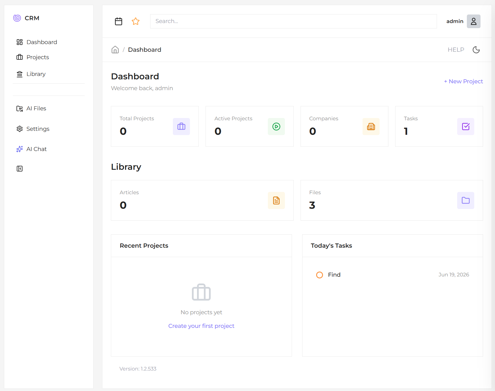

# CRM

## Description

This CRM system is designed around two primary goals that help keep engineering and project documentation structured, accessible, and easy to manage.

## 1. Centralized storage for all project‑related documents

Each project can contain everything required throughout its lifecycle:

- photos  
- technical drawings  
- documentation  
- notes  
- any additional files  

When you save a project to a selected location, the system automatically creates a **project folder with a unique number**. Inside this folder, all files are neatly organized into dedicated subdirectories, ensuring a clean and consistent project structure.

If you need to archive or transfer a project, you can simply **export it as a ZIP file** and move it wherever necessary.

---

## 2. Unified library for general documentation

The CRM also provides a structured space for collecting various types of information:

- documents  
- videos  
- articles  
- external resources  

You can even save articles **directly from the internet using their URLs**.  
All collected materials are stored in well‑organized folders, forming a clean and accessible knowledge base.

---

**Django 6.0.7 + Tailwind CSS 4 + Alpine.js + HTMX + AI Assistant**

A project management, contractor and task tracking system for engineering and manufacturing businesses. Features 14 custom apps, an AI assistant with command mode, and a modular HTMX-driven UI.

---

## Quick Start

```bash
python -m venv venv
venv\Scripts\activate
pip install -r requirements.txt
npm install
npm run build
python manage.py migrate
python manage.py createsuperuser
python manage.py runserver
```

Or run `install.bat` for one-click setup. Default credentials: `admin` / `admin`.

---

## Tech Stack

| Layer | Technology |
|-------|-----------|
| Backend | Django 6.0.7, Python 3.14+, SQLite |
| Frontend | Tailwind CSS 4 (CLI + CDN), Alpine.js 3.x, HTMX 2.0.4, Lucide Icons, Montserrat |
| AI | Ollama, Anthropic, OpenAI, Google, Mistral, Groq, DeepSeek, OpenRouter, OpenCode |
| Build | Tailwind CLI v4 (`npm run dev` / `npm run build`) |

---

## Modules

### Core
| Module | Description |
|--------|-------------|
| **Dashboard** | Key metrics, recent projects/tasks/notes, global search, settings panel |
| **Accounts** | Login/logout, profile, password reset (console email) |
| **Calendar** | Three-month rolling calendar with task due dates |

### Business
| Module | Description |
|--------|-------------|
| **Companies** | Company directory with contact info, logo, notes |
| **Contacts** | People directory linked to companies |
| **Projects** | Full lifecycle: statuses, budget, dates, gallery, ZIP export/import |
| **Tasks** | Prioritized tasks with statuses, due dates, per-project filtering |
| **Notes** | Universal notes linkable to projects, companies, or contacts |

### Engineering
| Module | Description |
|--------|-------------|
| **Materials / BOM** | Bill of Materials per project with categories, pricing, file attachments |
| **Documents** | File upload/preview (images, PDF, text) per project |
| **Parts** | Engineering drawings (DXF) and 3D models (STEP, Inventor, SolidWorks, STL) |

### Knowledge & AI
| Module | Description |
|--------|-------------|
| **Library** | Knowledge base with rich-text editor (Quill.js), articles auto-saved as `.md` files on disk with images, nested categories, tags, favorites, file attachments |
| **AI Assistant** | Multi-provider AI chat with CHAT/COMMANDS modes, browser agent, web search, file management |

### Tooling
| Module | Description |
|--------|-------------|
| **Generator** | Module scaffolding template with 12-step docs for rapid prototyping |

---

## AI Assistant

### Modes
- **CHAT** — free conversation with any configured AI model
- **COMMANDS** — natural-language CRM operations via regex-based intent detection

### Providers
Ollama (local), Anthropic, OpenAI, Google, Mistral, Groq, DeepSeek, OpenRouter, OpenCode — configurable via Settings panel. API keys encrypted with AES-GCM.

### Example Commands
```
Create project 001, Office Building on 2026-06-15
Add task Call client on 2026-06-10
Find contact Ivan
Add material Bolt 50 to project Test
Upload file drawing.pdf to project Test
Show all drawings of project Test
Create note Meeting for project Test
Open bbc.com
Download file from https://example.com/image.png
Create file hello.py with content print("Hello, World!")
Search for latest Python 3.14 features
Find pdf on site https://example.com
```

### Setup (Ollama)
1. Install [Ollama](https://ollama.com)
2. Pull a model: `ollama pull llama3.2`
3. Start Ollama (port 11434)
4. Select model in CRM chat interface

### Capabilities
Browser agent (SSRF protection), web search (DuckDuckGo), file management (50 MB/file, 1 GB quota), 10-second undo, audit logging, two-step confirmation for write operations.

---

## Project Structure

```
CRM/
  config/            Settings, URLs, WSGI, ASGI
  core/              Dashboard, base models, activity log, search, AI config
  accounts/          Authentication
  companies/         Company directory
  contacts/          Contact directory
  projects/          Full project lifecycle + ZIP export/import
  materials/         Bill of Materials
  tasks/             Task management
  notes/             Universal notes
  documents/         File upload/preview
  library/           Knowledge base (articles saved as .md on disk, categories, tags, files)
  parts/             Drawings & 3D models
  assistant/         AI chat, LLM, browser agent, command handlers
  calendar_app/      Calendar view
  generator/         Module scaffolding
  templates/         Base layout, includes (sidebar, topbar, chat, pagination)
  static/            Tailwind CSS source (src/) and dist/
  media/             User-uploaded files
  ai_files/          AI-downloaded files
```

---

## URL Routing

| Prefix | App | Purpose |
|--------|-----|---------|
| `/` | core | Dashboard, search, settings, AI API |
| `/accounts/` | accounts | Authentication |
| `/admin/` | admin | Django Admin |
| `/companies/` | companies | Company CRUD |
| `/contacts/` | contacts | Contact CRUD |
| `/projects/` | projects | Project lifecycle |
| `/tasks/` | tasks | Task management |
| `/notes/` | notes | Universal notes |
| `/materials/` | materials | BOM management |
| `/deals/` | generator | Deal CRUD (example scaffold) |
| `/documents/` | documents | File management |
| `/library/` | library | Knowledge base |
| `/parts/` | parts | Engineering drawings |
| `/assistant/` | assistant | AI chat |
| `/calendar/` | calendar_app | Calendar view |

---

## Data Models

All business models extend `TimeStampedModel` (`created_at`, `updated_at`, `created_by`, `is_active`).

| Model | Key Fields | Relationships |
|-------|-----------|---------------|
| **Company** | name, slug, email, phone, website, address, logo, notes | FK→Project, Contact, Note, Deal |
| **Contact** | first_name, last_name, slug, email, phone, position, avatar, notes | FK→Company |
| **Project** | name, slug, number, description, status, dates, budget, image | FK→Company; M2M→Contact |
| **ProjectImage** | image, uploaded_at | FK→Project |
| **Material** | name, slug, quantity, unit, unit_price, notes | FK→Project, Category |
| **Task** | title, slug, description, status, priority, due_date | FK→Project |
| **Note** | title, slug, content, date | FK→Project / Company / Contact |
| **Document** | number, size, file, file_type | FK→Project, Category |
| **LibraryItem** | title, slug, content (HTML), is_favorite, source_url, summary | FK→Category; M2M→Tag; auto-saved as `{slug}_{date}.md` on disk |
| **Part** | number, size, rev, file | FK→Project, Category |
| **Deal** (example) | name, slug, status, priority, value, due_date | FK→Company; M2M→Contact; FK→User |
| **Category** | name, slug, color, icon, parent (self-referential) | Materials, Documents, Parts, Library |
| **ChatSession** | title, is_active, last_message_at | FK→User |
| **ChatMessage** | role, kind, content, payload (JSON) | FK→Session |
| **AIFile** | original_name, source_url, size, category | FK→User |
| **AILog** | action, status, description, duration_ms | FK→User, Session |
| **Activity** | action, description, content_type, object_id | GenericForeignKey |
| **AIProvider** | name, type, encrypted API key, base_url, model | n/a |
| **AIModel** | model_id, name, tags (JSON) | FK→Provider |

---

## Features

- **Slide-over forms** — CRUD via HTMX without page navigation
- **Soft delete** — `is_active` flag on all business entities
- **Global search** — single page across all entity types
- **Activity logging** — all CRUD tracked via GenericForeignKey
- **Project export/import** — ZIP archives with JSON manifest
- **Dark mode** — localStorage-persisted, user-toggleable
- **Collapsible sidebar** — expandable/collapsible navigation
- **Settings panel** — configurable storage paths, naming, AI providers
- **AI undo** — 10-second undo window for write operations
- **Versioning** — `1.2.{git_commit_count}` via `core/version.py`
- **Security** — path traversal, SSRF, and open redirect protection

---

## Development

```bash
npm run dev       # Watch Tailwind
npm run build     # Production build
python manage.py collectstatic
python manage.py runserver
```

## Testing

```bash
python manage.py test core accounts assistant
```

Covers unit tests, navigation, and security (path traversal, SSRF, open redirects).

---

## File Storage

### Projects

Projects store files in organized directories:

```
{number}_{name}_Project/
  documents/
  drawings/
  models/
```

Subfolder naming is configurable via `AppSetting`. Storage backend uses custom `ProjectFileSystemStorage`.

### Library Articles

Articles are auto-saved as Markdown (`.md`) files on disk for portability:

```
{library_root}/
  {slug}_{YYYY-MM-DD}/
    {slug}_{YYYY-MM-DD}.md    # Full article content in Markdown
    images/                    # Downloaded/copied article images
    attachments/               # Uploaded file attachments
```

- Content is stored both in the database (HTML) and as `.md` on disk
- Storage root is configurable via `AppSetting` (falls back to `MEDIA_ROOT/library/`)
- Article folders are created on create/edit/import and recursively deleted on delete
- Images are served via a dedicated `/library/{slug}/image/{path}` view with path traversal protection
