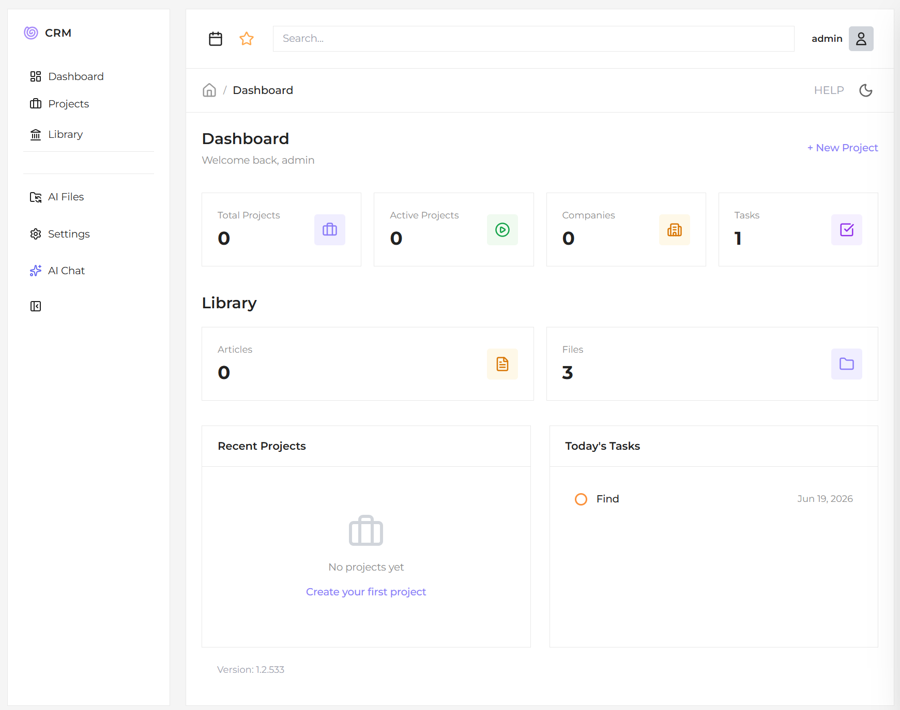
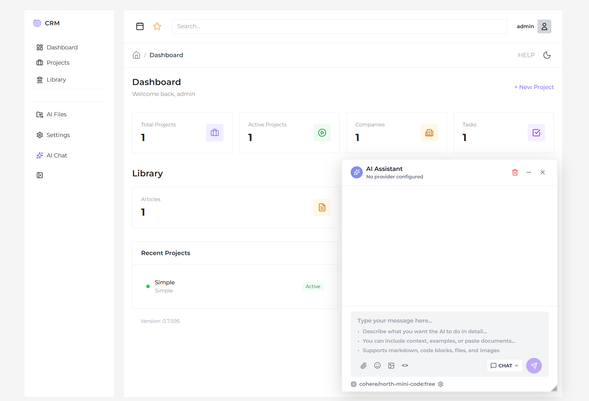

> **Django 6.x + Tailwind CSS 4 + Alpine.js + HTMX + AI Assistant**

A lightweight CRM/ERP platform designed for engineering and manufacturing teams.
It brings projects, tasks, materials, technical drawings, documents, and internal knowledge together in one unified workspace. Ideal for small manufacturing shops, CNC workshops, engineering bureaus, and teams that need structure without heavy corporate systems.

Key Features:

Project and task management

Material and BOM tracking

Support for engineering files (DXF, STEP, STL)

Centralized document storage

Knowledge base split into Articles, Gallery, and Files

AI assistant for automation and team support

Fast HTMX‑based interface without a heavy frontend

Purpose:
To give small industrial companies a simple, fast, and local ERP‑level tool that can be deployed without complex infrastructure.

---

## Product Description

### Goal 1: Centralized Project Documentation

Every project gets its own dedicated space. As soon as a project is created, you can start adding everything related to it:

- Photos
- Drawings and technical documents
- Notes
- Any other supporting files

Once the project is saved to a chosen location, the system automatically generates a numbered project folder. All documents belonging to that project are neatly organized inside, each type kept in its own subfolder — no manual sorting required.

When a project is finished, it can be archived and moved out of the active workspace, keeping the working area clean while preserving a complete, organized record for future reference.

### Goal 2: A Central Library for Reference Materials

Beyond individual projects, the CRM also serves as a knowledge base for general documentation the business collects over time:

- Documents
- Videos
- Articles

Articles can be saved directly from the internet via a link, making it easy to build a personal reference library without manual copy-pasting. As with projects, all saved materials are automatically organized into clearly structured folders.

The library is split into three independent sections — **Articles**, **Gallery**, and **Files** — each with its own page, filters, and upload flow (no shared tabs).

### Key Benefits

- **One place for everything** — no more hunting across folders, drives, and inboxes
- **Automatic organization** — numbered project folders and categorized subfolders are created without manual effort
- **Clean lifecycle management** — active projects stay easy to find; finished projects can be archived without losing structure
- **Built-in knowledge base** — a growing library of reference material, saved and organized alongside project work

A project management, contractor and task tracking system featuring 17 custom apps, an AI assistant with a command mode, and a modular HTMX-driven UI.

---

## Quick Start

```bash
python -m venv venv
venv\Scripts\activate
pip install -r requirements.txt
npm install
npm run build
python manage.py migrate
python manage.py seed_ai_providers   # seed AI provider list
python manage.py collectstatic
python manage.py createsuperuser
python manage.py runserver
```

Or run [install.bat](https://github.com/OlegUshakov-pl/CRM/blob/main/install.bat) for one-click setup (creates venv, installs Python + Node dependencies, builds Tailwind, runs migrations, seeds AI providers, collects static files, and creates a superuser). Default credentials: `admin` / `admin`.

Run `update.bat` after pulling new code to refresh dependencies and rebuild the frontend. Start the server anytime with `runserver.bat`.

---

## Tech Stack

| Layer | Technology |
|-------|-----------|
| Backend | Django 6.x, Python 3.14+, SQLite |
| Frontend | Tailwind CSS 4 (CLI + CDN), Alpine.js 3.x, HTMX 2.0.4, Lucide Icons, Montserrat |
| AI | Ollama, Anthropic, OpenAI, Google, Mistral, Groq, DeepSeek, OpenRouter, OpenCode |
| Build | Tailwind CLI v4 (`npm run dev` / `npm run build`) |

---

## Modules

### Core
| Module | Description |
|--------|-------------|
| **Dashboard** | Key metrics, recent projects/tasks/notes, global search, settings panel |
| **Accounts** | Login/logout, profile, password reset (console email) |
| **Calendar** | Three-month rolling calendar with task due dates |

### Business
| Module | Description |
|--------|-------------|
| **Companies** | Company directory with contact info, logo, notes |
| **Contacts** | People directory linked to companies |
| **Projects** | Full lifecycle: statuses, budget, dates, gallery, ZIP export/import |
| **Tasks** | Prioritized tasks with statuses, due dates, per-project filtering |
| **Notes** | Universal notes linkable to projects, companies, or contacts |

### Engineering
| Module | Description |
|--------|-------------|
| **Materials / BOM** | Bill of Materials per project with categories, pricing, file attachments |
| **Documents** | File upload/preview (images, PDF, text) per project |
| **Parts** | Engineering drawings (DXF) and 3D models (STEP, Inventor, SolidWorks, STL) |

### Knowledge & AI
| Module | Description |
|--------|-------------|
| **Articles** (`library_articles`) | Rich-text editor (Quill.js, resizable), URL import, cover Picture shown on cards, articles auto-saved as `.md` files on disk, nested categories, tags, favorites, file attachments |
| **Gallery** (`library_gallery`) | Photo grid with list/grid toggle, date filter, drag-and-drop upload, lightbox |
| **Files** (`library_files`) | File catalog with list/grid toggle, type/date filters, sorting, drag-and-drop upload |
| **Library** (`library`, shared core) | Shared `LibraryItem` / `Category` / `Tag` models, custom `LibraryStorage`, legacy routes |
| **AI Assistant** | Multi-provider AI chat with CHAT/COMMANDS modes, browser agent, web search, file management |

### Tooling
| Module | Description |
|--------|-------------|
| **Generator** | Module scaffolding template with 12-step docs for rapid prototyping |

---

## AI Assistant

### Modes
- **CHAT** — free conversation with any configured AI model
- **COMMANDS** — natural-language CRM operations via regex-based intent detection

### Providers
Ollama (local), Anthropic, OpenAI, Google, Mistral, Groq, DeepSeek, OpenRouter, OpenCode — configurable via Settings panel. API keys encrypted with AES-GCM.

### Example Commands
```
Create project 001, Office Building on 2026-06-15
Add task Call client on 2026-06-10
Find contact Ivan
Add material Bolt 50 to project Test
Upload file drawing.pdf to project Test
Show all drawings of project Test
Create note Meeting for project Test
Open bbc.com
Download file from https://example.com/image.png
Create file hello.py with content print("Hello, World!")
Search for latest Python 3.14 features
Find pdf on site https://example.com
```

### Setup (Ollama)
1. Install [Ollama](https://ollama.com)
2. Pull a model: `ollama pull llama3.2`
3. Start Ollama (port 11434)
4. Select model in CRM chat interface

### Capabilities
Browser agent (SSRF protection), web search (DuckDuckGo), file management (50 MB/file, 1 GB quota), 10-second undo, audit logging, two-step confirmation for write operations.

---

## Project Structure

```
CRM/
  config/            Settings, URLs, WSGI, ASGI
  core/              Dashboard, base models, activity log, search, AI config
  accounts/          Authentication
  companies/         Company directory
  contacts/          Contact directory
  projects/          Full project lifecycle + ZIP export/import
  materials/         Bill of Materials
  tasks/             Task management
  notes/             Universal notes
  documents/         File upload/preview
  library/           Shared knowledge-base core (LibraryItem, Category, Tag, LibraryStorage)
  library_articles/  Articles section (list/detail/create/edit, categories, import)
  library_gallery/   Gallery section (photo grid, upload)
  library_files/     Files section (file catalog, upload)
  parts/             Drawings & 3D models
  assistant/         AI chat, LLM, browser agent, command handlers
  calendar_app/      Calendar view
  generator/         Module scaffolding
  templates/         Base layout, includes (sidebar, topbar, chat, pagination)
  static/            Tailwind CSS source (src/) and dist/
  media/             User-uploaded files (default library root: media/library/)
  ai_files/          AI-downloaded files
```

The `Article`, `Photo`, and `FileDocument` models are proxies over `library.LibraryItem` — no extra tables, no data duplication. `Category` / `Tag` stay shared in `library`.

---

## URL Routing

| Prefix | App | Purpose |
|--------|-----|---------|
| `/` | core | Dashboard, search, settings, AI API |
| `/accounts/` | accounts | Authentication |
| `/admin/` | admin | Django Admin |
| `/companies/` | companies | Company CRUD |
| `/contacts/` | contacts | Contact CRUD |
| `/projects/` | projects | Project lifecycle |
| `/tasks/` | tasks | Task management |
| `/notes/` | notes | Universal notes |
| `/materials/` | materials | BOM management |
| `/deals/` | generator | Deal CRUD (example scaffold) |
| `/documents/` | documents | File management |
| `/library/articles/` | library_articles | Articles (list, detail, create/edit, categories, import) |
| `/library/gallery/` | library_gallery | Photo gallery + upload |
| `/library/files/` | library_files | File catalog + upload |
| `/library/` | library | Shared core + legacy routes |
| `/parts/` | parts | Engineering drawings |
| `/assistant/` | assistant | AI chat |
| `/calendar/` | calendar_app | Calendar view |

---

## Data Models

All business models extend `TimeStampedModel` (`created_at`, `updated_at`, `created_by`, `is_active`).

| Model | Key Fields | Relationships |
|-------|-----------|---------------|
| **Company** | name, slug, email, phone, website, address, logo, notes | FK→Project, Contact, Note, Deal |
| **Contact** | first_name, last_name, slug, email, phone, position, avatar, notes | FK→Company |
| **Project** | name, slug, number, description, status, dates, budget, image | FK→Company; M2M→Contact |
| **ProjectImage** | image, uploaded_at | FK→Project |
| **Material** | name, slug, quantity, unit, unit_price, notes | FK→Project, Category |
| **Task** | title, slug, description, status, priority, due_date | FK→Project |
| **Note** | title, slug, content, date | FK→Project / Company / Contact |
| **Document** | number, size, file, file_type | FK→Project, Category |
| **LibraryItem** | title, slug, content (HTML), file, file_type, preview_image, is_favorite, source_url, summary | FK→Category; M2M→Tag; auto-saved as `{slug}_{date}.md` on disk |
| **Article** (proxy) | articles only (non-empty content) | Proxy over LibraryItem |
| **Photo** (proxy) | file-only images (no article content) | Proxy over LibraryItem |
| **FileDocument** (proxy) | file-only documents (no article content) | Proxy over LibraryItem |
| **LibraryAttachment** | file, name, uploaded_at | FK→LibraryItem |
| **Part** | number, size, rev, file | FK→Project, Category |
| **Deal** (example) | name, slug, status, priority, value, due_date | FK→Company; M2M→Contact; FK→User |
| **Category** | name, slug, color, icon, parent (self-referential) | Materials, Documents, Parts, Library |
| **ChatSession** | title, is_active, last_message_at | FK→User |
| **ChatMessage** | role, kind, content, payload (JSON) | FK→Session |
| **AIFile** | original_name, source_url, size, category | FK→User |
| **AILog** | action, status, description, duration_ms | FK→User, Session |
| **Activity** | action, description, content_type, object_id | GenericForeignKey |
| **AIProvider** | name, type, encrypted API key, base_url, model | n/a |
| **AIModel** | model_id, name, tags (JSON) | FK→Provider |

---

## Features

- **Slide-over forms** — CRUD via HTMX without page navigation
- **Soft delete** — `is_active` flag on all business entities
- **Global search** — single page across all entity types
- **Activity logging** — all CRUD tracked via GenericForeignKey
- **Project export/import** — ZIP archives with JSON manifest
- **Dark mode** — localStorage-persisted, user-toggleable
- **Collapsible sidebar** — expandable/collapsible navigation without reload flicker
- **Settings panel** — configurable storage paths, naming, AI providers
- **AI undo** — 10-second undo window for write operations
- **Versioning** — `0.7.{git_commit_count}` via `core/version.py`
- **Security** — path traversal, SSRF, and open redirect protection

---

## Development

```bash
npm run dev       # Watch Tailwind
npm run build     # Production build
python manage.py collectstatic
python manage.py runserver
```

## Testing

```bash
python manage.py test core accounts assistant
```

Covers unit tests, navigation, and security (path traversal, SSRF, open redirects).

---

## File Storage

### Projects

Projects store files in organized directories:

```
{number}_{name}_Project/
  documents/
  drawings/
  models/
```

Subfolder naming is configurable via `AppSetting`. Storage backend uses custom `ProjectFileSystemStorage`.

### Library

Everything library-related lives in one root folder (configurable via `AppSetting` `storage.project_path`, falls back to `MEDIA_ROOT/library/`), next to the article folders:

```
{library_root}/
  files/                     # Uploaded documents (PDF, DOCX, TXT, ...)
  images/                    # Gallery uploads, article covers, preview images
  {slug}_{YYYY-MM-DD}/
    {slug}_{YYYY-MM-DD}.md   # Full article content in Markdown
    images/                  # Downloaded/copied article images
    attachments/             # Uploaded file attachments
```

- Content is stored both in the database (HTML) and as `.md` on disk
- Upload routing (`files/` vs `images/`) is extension-based; uploads use the custom `LibraryStorage` backend
- Uploads are served via the login-protected `/library/uploads/...` view with path traversal protection (not via `/media/`)
- Article folders are created on create/edit/import and recursively deleted on delete
- Article content images are served via a dedicated `/library/{slug}/image/{path}` view with path traversal protection
- Article **Picture** (cover) is set on the edit page, shown first on article cards (imported preview image is the fallback), and never appears in the Gallery

## License

License: MIT

---

## Movies tutorial

### CRM Install
[](https://youtu.be/6uPxHwF2sys)

### Creating of a project in CRM
[](https://youtu.be/Z5n2gr-W1yo)

### A library of books
[](https://youtu.be/P3DGkeb9Oh8)

### Import and Export of the Project
[](https://youtu.be/wBJ8hBmErec)


## Screenshots

<p>
  <a href="screenshots/Home1.png"></a>
  <a href="screenshots/Home2.png"></a>
  <a href="screenshots/Projects.png"></a>
  <a href="screenshots/Materials.png"></a>
  <a href="screenshots/Drawings.png"></a>
  <a href="screenshots/Tasks.png"></a>
  <a href="screenshots/Documents.png"></a>
  <a href="screenshots/Companies.png"></a>
  <a href="screenshots/Contacts.png"></a>
  <a href="screenshots/Contact.png"></a>
  <a href="screenshots/Notes.png"></a>
  <a href="screenshots/Note.png"></a>
  <a href="screenshots/Library.png"></a>
  <a href="screenshots/New%20document.png"></a>
  <a href="screenshots/Categories.png"></a>
  <a href="screenshots/Photo%20gallery.png"></a>
  <a href="screenshots/Files%20catalog.png"></a>
  <a href="screenshots/Settings.png"></a>
  <a href="screenshots/Settings%20Ai.png"></a>
  <a href="screenshots/Chat.png"></a>
</p>
